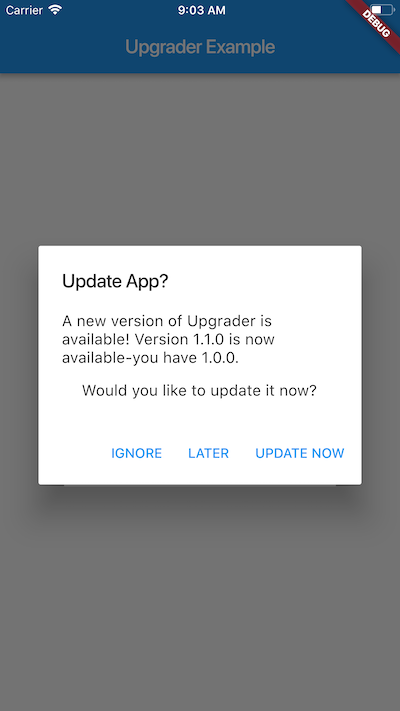

# Upgrader

Flutter package for prompting users to upgrade when there is a newer version of the app in the store.

[](https://travis-ci.org/larryaasen/upgrader) [](https://codecov.io/gh/larryaasen/upgrader) [](https://pub.dartlang.org/packages/upgrader)

A simple prompt widget is displayed when a newer app version is availabe
in the store.

## Example

Just wrap your body widget in the UpgradeAlert widget. It will handle the rest.
```dart
import 'package:flutter/material.dart';
import 'package:upgrader/upgrader.dart';

void main() => runApp(MyApp());

class MyApp extends StatelessWidget {
  MyApp({
    Key key,
  }) : super(key: key);

  @override
  Widget build(BuildContext context) {
    return MaterialApp(
      title: 'Upgrader Example',
      home: Scaffold(
          appBar: AppBar(
            title: Text('Upgrader Example'),
          ),
          body: UpgradeAlert(
            child: Center(child: Text('Checking...')),
          )
      ),
    );
  }
}
```

## Screenshot



## Customization

The UpgradeAlert widget can be customized by setting parameters in the constructor of the
UpgradeAlert widget.

* buttonTitleIgnore: the ignore button title, which defaults to ```Ignore```
* buttonTitleRemind: the remind button title, which defaults to ```Later```
* buttonTitleUpdate: the update button title, which defaults to ```Update Now```
* daysUntilAlertAgain: days until alerting user again, which defaults to ```3```
* debugEnabled: Enable print statements for debugging, which defaults to ```false```

* onIgnore: Called when the ignore button is tapped, defaults to ```null```
* onLater: Called when the ignore button is tapped, defaults to ```null```
* onUpdate: Called when the ignore button is tapped, defaults to ```null```
  
* prompt: the call to action message, which defaults to ```Would you like to update it now?```
* title: the alert dialog title, which defaults to ```Update App?```

## Limitations
This widget works on both Android and iOS. When running on iOS the App Store will provide the
latest app version and will display the prompt at the appropriate times.

On Android, this widget does nothing as there is no easy way to query the
Google Play Store for metadata about an app. Without the metadata, the widget cannot compare the
app version with the latest Play Store version. It will not disrupt the widget tree and can be
included in an Android without any issues. Support for Android coming soon.

## iTunes Search API

There is a class in this Flutter package used by the UpgradeAlert widget to download app details 
from the
[iTunes Serach API](https://affiliate.itunes.apple.com/resources/documentation/itunes-store-web-service-search-api).
The class ITunesSearchAPI can be used standalone with the
UpgradeAlert widget to query iTunes for app details.
```dart
final iTunes = ITunesSearchAPI();
final results = await iTunes.lookupURLByBundleId('com.google.Maps');
```

## Contributing
All [comments](https://github.com/larryaasen/upgrader/issues) and [pull requests](https://github.com/larryaasen/upgrader/pulls) are welcome.